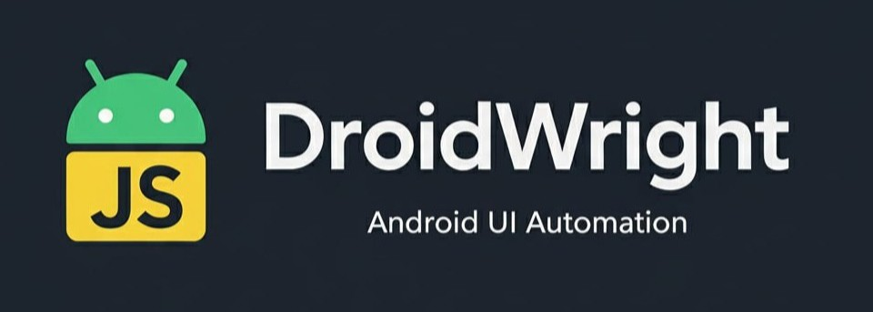

<div align="center">



**Powerful, flexible automation for Android - right on your device**

[](https://github.com/tas33n/droidwright/releases)
[](LICENSE)
[](https://www.android.com)

</div>

---

> **Note:** This repository currently hosts placeholder assets only. The full DroidWright source code will be published soon; for now this space is being used as a placeholder and for bug tracking.

## Why We Built This

Let's be honest - most automation apps on the Play Store are pretty limited. They give you basic click-and-swipe actions with rigid templates, but when you need real control and flexibility, they fall short. That's why we built DroidWright.

**DroidWright is different.** It's built for developers and power users who want:

- **Full script control** - Write your automation logic exactly how you want it, not limited by pre-made templates
- **Developer-friendly** - Use JavaScript, a language you already know, with a clean API that makes sense
- **Within-Android automation** - No need for a desktop computer or ADB access. Everything runs directly on your device
- **More power and flexibility** - Tap, swipe, scroll, type, wait, loop, conditionals - you name it, you can do it

Think of it as the difference between using a basic macro recorder versus writing your own automation code. If you've ever been frustrated by the limitations of those click automation apps, DroidWright is what you've been waiting for.

## Our Inspiration

We took inspiration from two amazing open-source tools that revolutionized web and mobile automation:

- **[Appium](https://appium.io/)** - The industry standard for mobile app automation
- **[Playwright](https://playwright.dev/)** - Microsoft's powerful browser automation framework

Both of these tools are fantastic, but they have one thing in common: they require a desktop computer and often need ADB access or device connections. What if you could have that same level of control and power, but running entirely on your Android device?

That's exactly what DroidWright does. We took the core ideas that made Appium and Playwright great - script-based automation, developer-friendly APIs, and powerful control - and built it to work **within Android itself**. No desktop needed. No ADB required. Just your phone and your scripts.

## 🚀 Features

- **JavaScript-Based Scripts**: Write automation tasks using familiar JavaScript syntax
- **AI-Powered Automation**: Optional integration with Google Gemini AI for intelligent task execution
- **Comprehensive UI Interaction**: Tap, scroll, swipe, type text, and interact with any UI element
- **App Control**: Launch, close, and monitor any installed Android app
- **Real-time Logging**: Monitor script execution with live console output and full logcat integration
- **Script Management**: Create, edit, import, and organize automation scripts
- **Material Design 3**: Modern, responsive user interface
- **Safety Features**: Built-in rate limiting, resource monitoring, and ANR prevention

## 📋 Prerequisites

- **Android Device**: API level 24 (Android 7.0) or higher
- **Accessibility Service**: Must be enabled in system settings
- **Overlay Permission**: Required for floating controls
- **Target App**: The app you want to automate must be installed

## 🔧 Installation

### From Source

1. Clone the repository:
```bash
git clone https://github.com/tas33n/droidwright.git
cd droidwright
```

2. Open in Android Studio or build from command line:
```bash
./gradlew assembleDebug
```

3. Install on device:
```bash
adb install app/build/outputs/apk/debug/app-debug.apk
```

### APK Download

Download the latest release APK from the [Releases](https://github.com/tas33n/droidwright/releases) page.

## 🎯 Quick Start

1. **Enable Accessibility Service**:
   - Go to Settings → Accessibility
   - Find "DroidWright Automation Service"
   - Enable it

2. **Grant Permissions**:
   - Allow overlay permission when prompted
   - Grant any runtime permissions requested

3. **Create Your First Script**:
   - Open the app
   - Go to Scripts tab
   - Tap the "+" button
   - Write your automation script (see [docs.md](docs.md) for detailed guide)

4. **Run Your Script**:
   - Tap the play button on your script
   - Watch the logs in real-time
   - Use the floating controls to pause/stop

## 📖 Documentation

- **[docs.md](docs.md)**: Complete guide to writing automation scripts
- **[API Reference](docs.md#api-reference)**: All available APIs and methods
- **[Examples](examples/)**: Sample scripts for common tasks

## 💡 Example Script

```javascript
function run(ctx) {
  log("Starting Instagram automation");
  
  // Launch Instagram
  const TARGET_APP = "com.instagram.android";
  ctx.app.launch(TARGET_APP);
  ctx.device.sleep(3000);
  
  // Wait for feed to load
  ctx.ui.waitFor({ text: "Home" }, 5000);
  
  // Scroll down
  const size = ctx.device.getScreenSize();
  ctx.ui.swipe(size.width / 2, size.height * 0.8, size.width / 2, size.height * 0.2, 500);
  ctx.device.sleep(2000);
  
  // Like a post (using resource ID)
  ctx.ui.tap({ id: "like_button" });
  ctx.device.sleep(1000);
  
  log("Automation completed");
  return { status: "ok", note: "Success" };
}
```

## 🛠️ Technologies

- **Kotlin**: Primary programming language
- **Jetpack Compose**: Modern UI framework
- **Android Accessibility Service**: Core automation engine
- **QuickJS**: JavaScript runtime for script execution
- **Material Design 3**: Design system
- **Room Database**: Local script storage
- **Coroutines**: Asynchronous programming

## 🔒 Permissions

- **Accessibility Service**: Required for UI interaction
- **SYSTEM_ALERT_WINDOW**: For floating controls
- **INTERNET**: For AI agent integration (optional)
- **Storage**: For importing/exporting scripts

## ⚠️ Important Notes

- **Rate Limiting**: The framework includes built-in rate limiting to prevent ANR (Application Not Responding) errors
- **Safety First**: Scripts automatically include delays and resource monitoring
- **AI Integration**: Optional - requires Google Gemini API key for AI-powered automation
- **Use Responsibly**: Always respect app terms of service and use automation ethically

## 🐛 Troubleshooting

### Scripts Not Running
1. Verify accessibility service is enabled
2. Check that target app is installed
3. Review console logs for errors
4. Ensure all permissions are granted

### ANR Errors
- The framework includes automatic rate limiting
- Increase delays between actions if needed
- Check system memory usage

### Import Issues
- Ensure script file is valid JavaScript
- Check file encoding (UTF-8 recommended)
- Verify script has a `run(ctx)` function

## 🤝 Contributing

Contributions are welcome! We'd love to have your help making DroidWright even better.

1. Fork the repository
2. Create your feature branch (`git checkout -b feature/AmazingFeature`)
3. Commit your changes (`git commit -m 'Add some AmazingFeature'`)
4. Push to the branch (`git push origin feature/AmazingFeature`)
5. Open a Pull Request

## 💰 Sponsorship

DroidWright is an open-source project built with passion and dedication. If you find it useful and want to support its development, we'd be incredibly grateful!

**Ways to support:**

- ⭐ Star the repository - it helps others discover the project
- 🐛 Report bugs and suggest features
- 💻 Contribute code or documentation
- 💰 **Financial support** - Help us keep the project alive and growing

Like many open-source projects, maintaining and improving DroidWright takes time and effort. Your sponsorship helps us:
- Keep the project actively maintained
- Add new features and improvements
- Fix bugs faster
- Improve documentation
- Support the community

**Thank you for considering supporting DroidWright!** Every bit helps, and we truly appreciate it.

### 💳 Donation Methods

**Crypto Donations:**
- **Bitcoin (BTC)**: `14FmP4WQ61mBEqfGed1FAqdYnHDba2Fc4U`
- **Ethereum (ETH - ERC20)**: `0x02537e13e5471cebf857fcd1f743d4af408af437`
- **BNB (BEP20/BSC)**: `0x02537e13e5471cebf857fcd1f743d4af408af437`
- **USDT (TRC20)**: `TDKQzgQni56eRgKLWanUey21UPSKToDQjJ`
- **Binance Pay ID**: `1150943446`

**Other Methods:**
- [GitHub Sponsors](https://github.com/sponsors/tas33n) (coming soon)

## 📝 License

This project is open source and available under the [MIT License](LICENSE).

Copyright © 2025 tas33n

## 👤 Author

**tas33n**

- GitHub: [@tas33n](https://github.com/tas33n)
- Project: [DroidWright](https://github.com/tas33n/droidwright)

## 📧 Contact

Need help, have questions, or want to collaborate? Feel free to reach out:

- **Email**: [farhanisteak84@gmail.com](mailto:farhanisteak84@gmail.com)
- **Telegram**: [@lamb3rt](https://t.me/lamb3rt)

We're always happy to help and hear from the community!

## 🙏 Acknowledgments

- Android Accessibility Service team
- QuickJS developers
- Material Design team
- Appium and Playwright teams for inspiration
- All contributors and users who make this project better

## 📚 Resources

- [Script Writing Guide](docs.md)
- [Android Developers](https://developer.android.com)
- [Jetpack Compose Documentation](https://developer.android.com/jetpack/compose)
- [Material Design 3](https://m3.material.io)

---

**Note**: This is a beta release. Some features may change in future versions. Use responsibly and in accordance with app terms of service.
